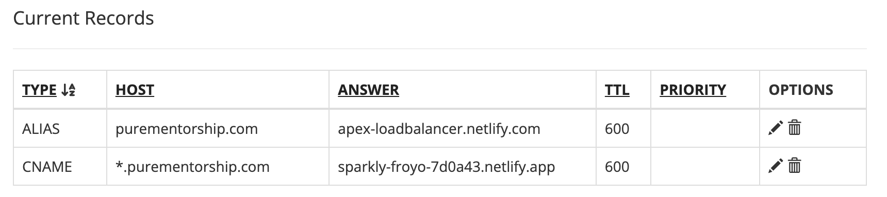

###

<div align="center">
  <h1 align="left" style="display: flex; align-items: center; margin-bottom: 2px;">
    Pure Mentorship
    <span> </span>
  </h1>
  
</div>


> Pure Mentorship is a platform created by students, for students.


## Project Overview
The primary goal of this internship project was to rebuild the Pure Mentorship company website using a more modern and scalable architecture. This involved transitioning to a new tech stack to improve maintainability and future development.

## Tech Stack
- React
- Tailwind CSS
- shadcn/ui

## Current Project State
As of November 2024, the website rebuild has reached the following state:

1. Functional static website
2. Modern architecture implemented
3. Core pages and navigation in place
4. Published on purementorship.com

## Completed Tasks
- Set up React project structure
- Implemented Tailwind CSS for styling
- Created main page layouts
- Established basic navigation
- Populated missing content
- Website deployed on Netlify
- Connected to Porkbun domain
- Blog section removed and a link to the old blog was added
- Responsive design

## Pending Tasks
The following items need attention from future interns:

1. Dynamic Content:
   - Identify areas where dynamic content could enhance user experience
   - Implement API calls to serve dynamic content where appropriate

2. Testing and Optimization:
   - Optimize performance, especially image loading and page speed

## Future Considerations
1. Image Optimization: When the website first loads the images take some time to render. Consider optimizing this. 
2. Calendly links for mentor / mentee applications. 

## Handover Notes
1. Development environment setup instructions can be found in the README.md file.
2. Unable to dynamically retrieve blog content using Wix API due to API restrictions. Wix API does not allow requests from browser and only return plain text content.
3. The website is live on https://purementorship.com/. DNS Records are configured on Porkbun to point to Netlify servers.



4. SSL certificates for https are configured on Netlify.

## Running the Project Locally

This project is a basic Vite app. To run it locally, follow these steps:

1. Clone the repository:
   ```
   git clone https://github.com/Cole-Hartman/purementorship.git
   cd purementorship
   ```

2. Install dependencies:
   ```
   npm install
   ```

3. Start the development server:
   ```
   npm run dev
   ```

4. Open your browser and navigate to the local server address (typically `http://localhost:5173` or as indicated in the terminal output).

Make sure you have Node.js and npm (Node Package Manager) installed on your system before running these commands.

## Authors

- [@Cole Hartman](https://github.com/Cole-Hartman)
- [@Noah Kim](https://github.com/boatnoah)
- [@Ingrid Miranda](https://github.com/ingridmidia)


